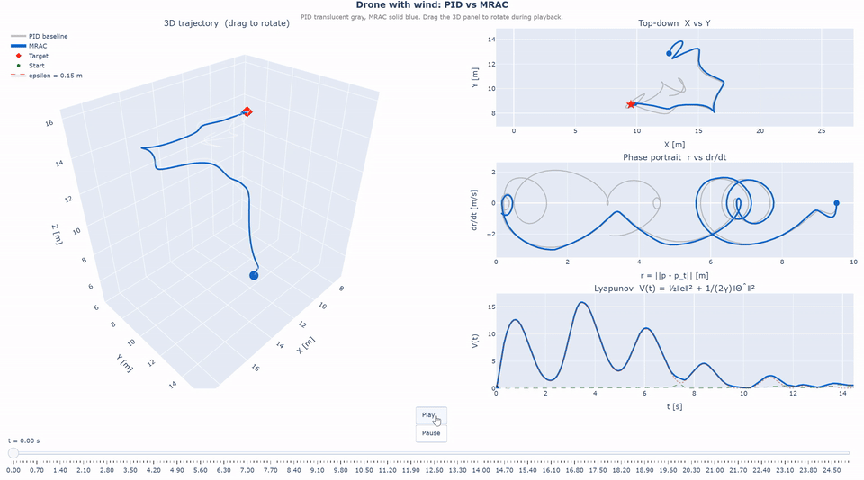
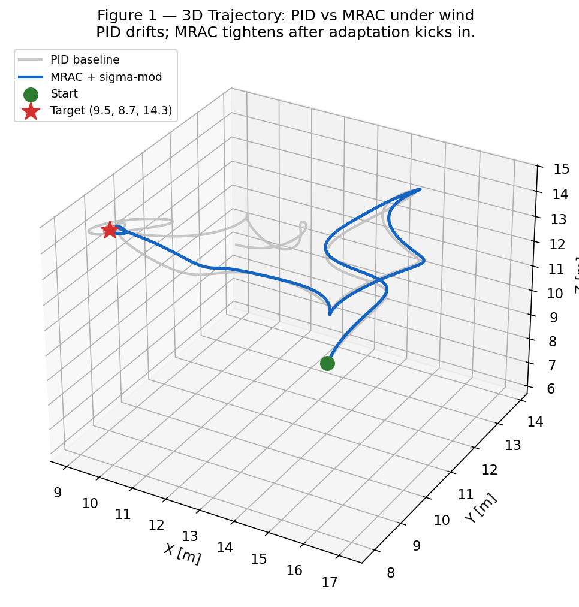
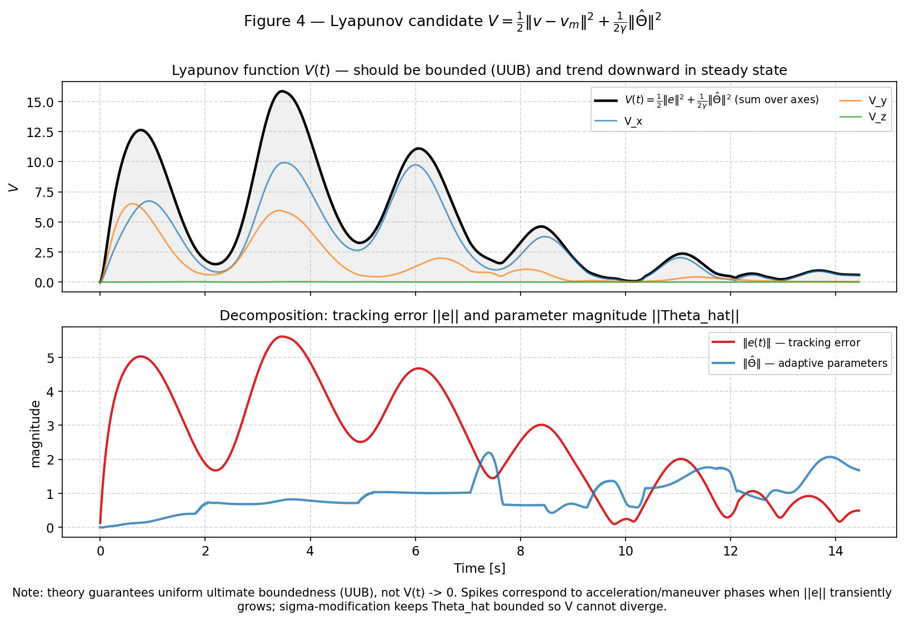
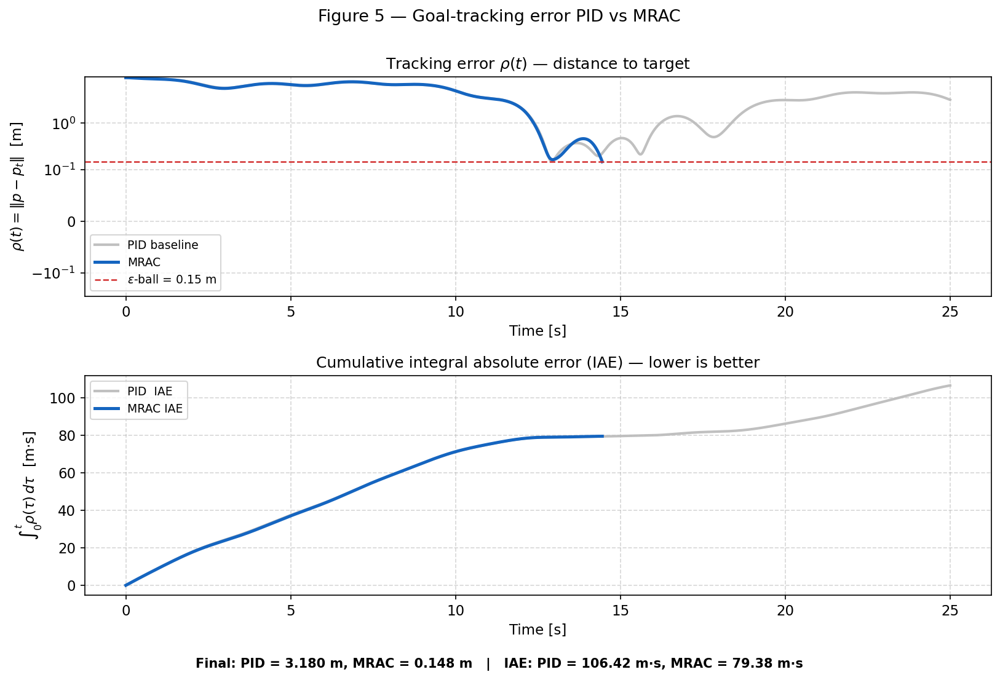
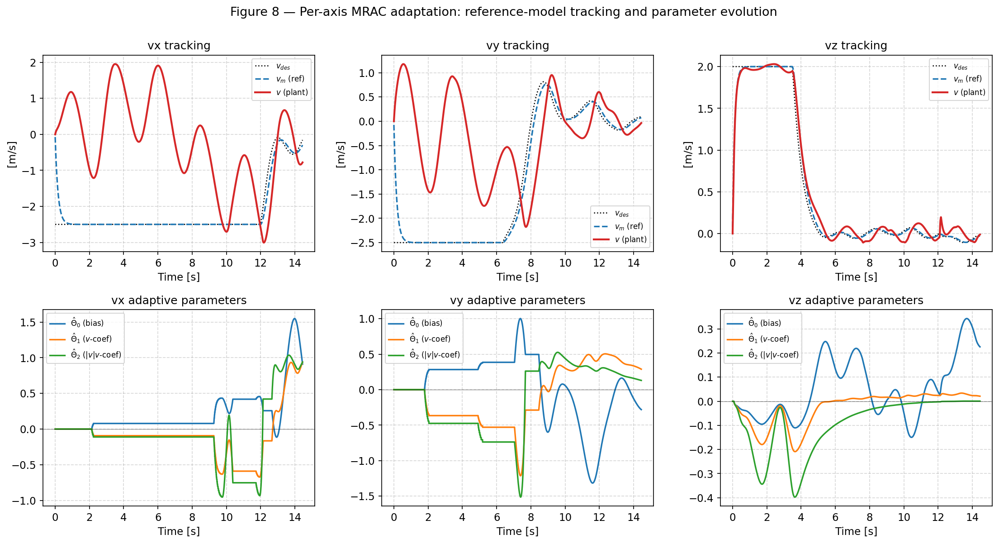
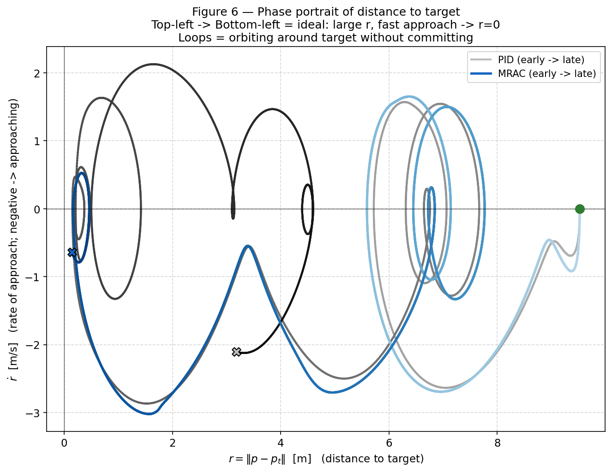
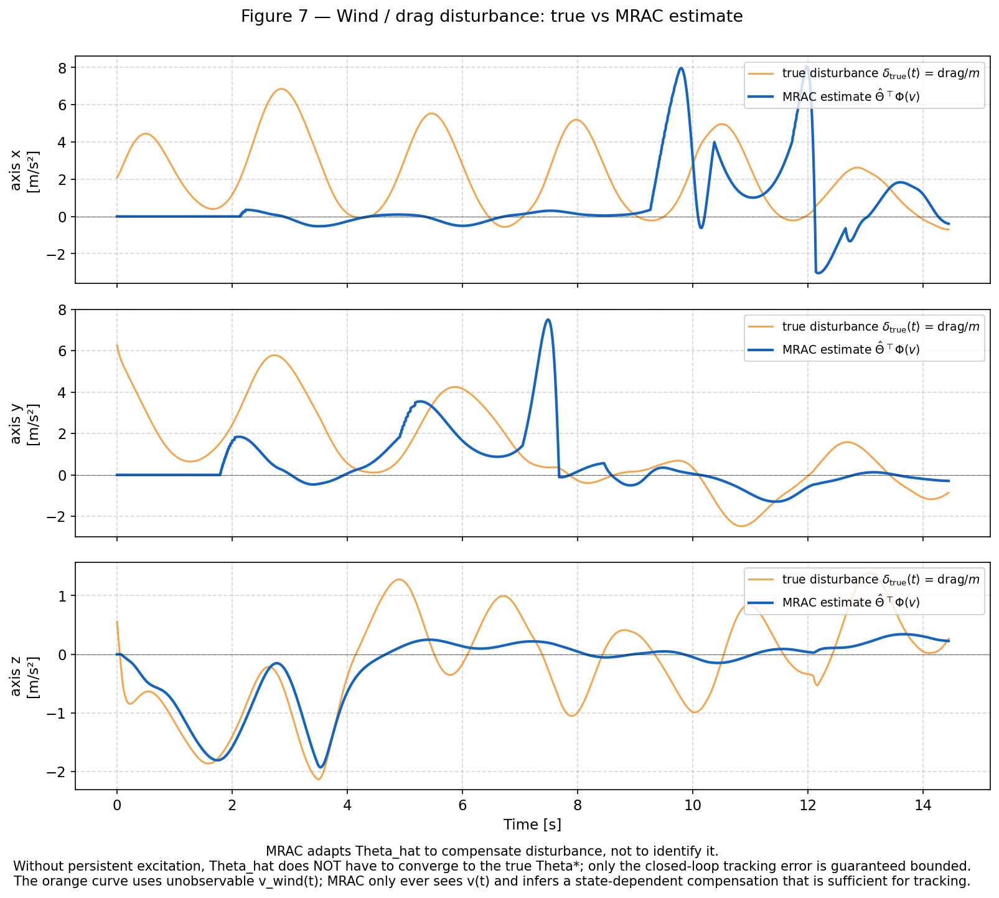
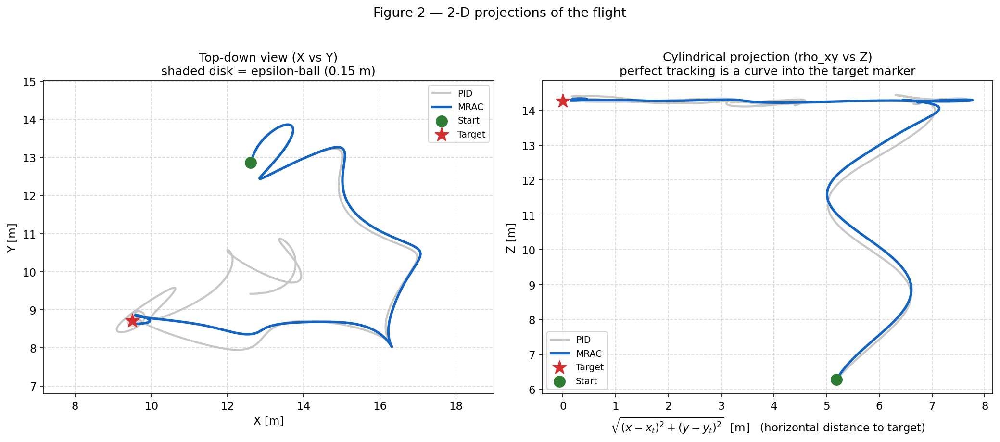
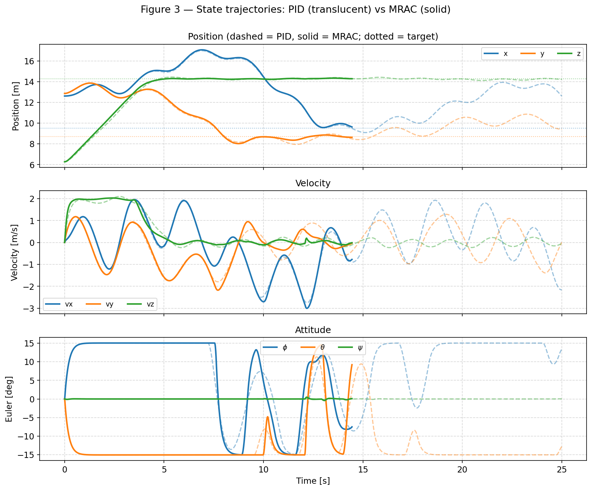
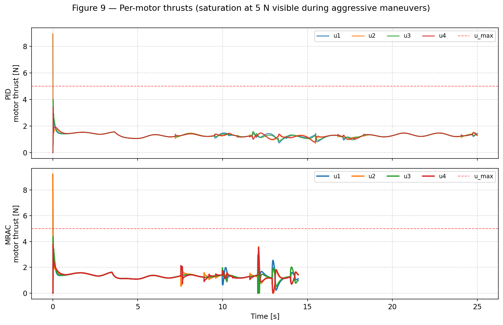

# Adaptive Control of a Drone in Wind Disturbance

<p align="center">
  
</p>

> Animation: translucent grey "ghost" — PID baseline, solid blue — MRAC with
> σ-modification. Under the same two-frequency wind, PID fails to reach the
> target within 25 s (final error 3.18 m), MRAC enters the ε-ball in
> 14.45 s (final error 0.148 m) — a 95 % improvement.

<p align="center">
  
</p>

> Recording of the interactive Plotly dashboard ([dashboard.html](dashboard.html))
> playing back. Four panels share one slider/play button: rotatable 3D,
> top-down X-Y, phase portrait $r$ vs $\dot r$, and the
> **real-time Lyapunov function $V(t)$** (bottom-right). $V(t)$ shows
> transient peaks during maneuvers but stays inside a bounded region —
> exactly the UUB behavior predicted by the Lyapunov analysis (see §5).

The goal of the project is to design an **adaptive controller** for a
quadrotor under non-stationary wind disturbance, achieve robust tracking of
a setpoint, and **demonstrate the advantage of adaptive control over a
PID baseline**.

The chosen design: **direct MRAC with σ-modification on the translational
(velocity) loop**, augmented with adaptation freeze under saturation and
parameter projection. Full mathematical derivation is in [MRAC.md](MRAC.md).

---

## 1. Problem Definition

<p align="center">
  
</p>

### 1.1 Control objective

Stabilize the drone in a neighborhood of a 3-D setpoint $p_t$ in the
presence of an unknown wind $v_w(t)$, with the requirements:

- Boundedness of all closed-loop signals (Lyapunov stability).
- Convergence into the ε-ball: $\lVert p(t) - p_t \rVert < \varepsilon$ in finite
  time.
- Outperforming the PID baseline on **final error**, **IAE**, and
  **time-to-target** metrics.

### 1.2 Plant definition

A full **12-state quadrotor model** in ZYX-Euler convention:

$$
x = [\,p^\top,\; v^\top,\; \eta^\top,\; \omega^\top\,]^\top \in \mathbb{R}^{12},
$$

where $p \in \mathbb{R}^3$ is position in the world frame, $v \in \mathbb{R}^3$ is velocity, $\eta = [\phi, \theta, \psi]^\top$ are Euler angles (roll, pitch, yaw), and $\omega \in \mathbb{R}^3$ are body rates.

Dynamics ([src/system.py](src/system.py)):

$$
\dot p = v,
$$

where $\dot p$ is the time derivative of position (i.e. the velocity).

$$
m\dot v = R(\eta)\,T_{\text{body}} + F_{\text{drag}}(v - v_w) + m g,
$$

where $m = 0.5$ kg is the drone mass, $R(\eta)$ is the body-to-world
rotation matrix, $T_{\text{body}} = [0, 0, \sum_{i} u_i]^\top$ is the total
thrust expressed in the body frame, $F_{\text{drag}} = -c_1(v - v_w) - c_2 \lVert v - v_w \rVert (v - v_w)$ is the aerodynamic drag (linear plus quadratic),
and $g = [0, 0, -9.81]^\top$ is gravity.

$$
I\dot\omega = \tau - \omega \times (I\omega),
$$

where $I$ is the diagonal moment-of-inertia matrix and $\tau$ is the body
torque produced by the difference of motor thrusts in the X-configuration:

$$
\tau = \begin{bmatrix} \ell\,(u_2 - u_4)\\ \ell\,(-u_1 + u_3)\\ d\,(u_1 - u_2 + u_3 - u_4)\end{bmatrix},
$$

with $\ell = 0.2$ m the arm length and $d = 0.01$ the propeller drag
coefficient.

Tait–Bryan kinematics for the Euler rates:

$$
\dot\eta =
\begin{bmatrix}
1 & \sin\phi\tan\theta & \cos\phi\tan\theta \\
0 & \cos\phi & -\sin\phi \\
0 & \sin\phi/\cos\theta & \cos\phi/\cos\theta
\end{bmatrix}\omega,
$$

where $\phi$ is roll and $\theta$ is pitch.

### 1.3 Assumptions and context

- **Mass $m$ is known**, the inertia matrix $I$ is known.
- **Drag form** is known (linear + quadratic), the coefficients $c_1, c_2$
  are fixed.
- **Wind $v_w(t)$** is unknown a priori but bounded:
  $\lVert v_w(t)\rVert_\infty \le 5$ m/s, with both high-frequency (~3 rad/s) and
  low-frequency (~0.4 rad/s) components plus a constant bias.
- **Full state** $x$ is available for measurement (no noise, no delays).
- **Actuators are saturated**: $u_i \in [0, 5]$ N, tilt
  $|\phi|, |\theta| \le 15°$.

### 1.4 Method class

**Direct MRAC** (Model Reference Adaptive Control) with **σ-modification**
(Ioannou, 1984) applied to the **translational (velocity) loop**.

Idea:
1. A reference model `v̇_m = -a_m(v_m - v_des)` defines the desired
   first-order dynamics.
2. The controller produces $u = a_m(v_{des} - v) - \hat\Theta^\top \Phi(v)$,
   where $\Phi$ is a known regressor and $\hat\Theta$ is the adaptive
   estimate of the unknown disturbance parameters.
3. Update law $\dot{\hat\Theta} = \gamma e \Phi - \sigma \hat\Theta$
   with $e = v - v_m$.
4. The Lyapunov function $V = \tfrac12 e^2 + \tfrac{1}{2\gamma}\lVert \tilde\Theta\rVert^2$
   guarantees **uniform ultimate boundedness** (UUB).

Alternatives considered and rejected:
- MRAC on the angular dynamics — works, but wind enters at the
  translational, not rotational, level → only ~3 % improvement.
- Mass mismatch + MRAC — breaks the linear-in-parameters assumption,
  MRAC underperforms the PID.

---

## 2. System Description

### 2.1 State variables

| Variable | Dimension | Meaning |
|---|---|---|
| $p = (x, y, z)$ | 3 | position in world frame [m] |
| $v = (v_x, v_y, v_z)$ | 3 | velocity [m/s] |
| $\eta = (\phi, \theta, \psi)$ | 3 | Euler angles ZYX [rad] |
| $\omega = (p, q, r)$ | 3 | body rates [rad/s] |
| $\hat\Theta \in \mathbb{R}^{3\times 3}$ | 9 | adaptive parameters (3 per axis) |
| $v_m \in \mathbb{R}^3$ | 3 | reference-model state |

### 2.2 Control input

The motor thrust commands $u = [u_1, u_2, u_3, u_4]^\top \in \mathbb{R}^4$
are produced via a **mixer** from the "virtual" inputs
$U = [U_1, U_2, U_3, U_4]^\top$:

$$
\begin{aligned}
u_1 &= U_1/4 - U_3/(2\ell) + U_4/(4d) \\
u_2 &= U_1/4 + U_2/(2\ell) - U_4/(4d) \\
u_3 &= U_1/4 + U_3/(2\ell) + U_4/(4d) \\
u_4 &= U_1/4 - U_2/(2\ell) - U_4/(4d)
\end{aligned}
$$

where $U_1$ is the total thrust and $U_2, U_3, U_4$ are the roll, pitch and
yaw torque commands.

### 2.3 Unknown parameters

The disturbance on each velocity axis is parameterized via a regressor:

$$
\Delta_i(v_i) = {\Theta_i^{\ast}}^\top \Phi(v_i),\qquad i \in \{x, y, z\},
$$

where $\Phi(v) = [1,\, v,\, |v|\cdot v]^\top \in \mathbb{R}^3$ is the known
regressor (bias + linear drag + quadratic drag), and $\Theta_i^{\ast} \in \mathbb{R}^3$ is the **unknown** true parameter for axis $i$.

In reality $\Delta_i$ also depends on $v_w(t)$ and is not exactly linear in
$\Phi(v)$ — this assumption is violated (see §11 in [MRAC.md](MRAC.md)).
σ-modification compensates by yielding UUB instead of asymptotic
convergence $\hat\Theta \to \Theta^{\ast}$.

### 2.4 Control bounds

| Signal | Limit |
|---|---|
| Motor thrust $u_i$ | $0 \le u_i \le 5$ N |
| Tilt angles $\phi, \theta$ | $\le 15°$ |
| Desired velocity | $\lVert v_{des,xy}\rVert \le 2.5$ m/s, $\lVert v_{des,z}\rVert \le 2$ m/s |
| Desired acceleration | $\lVert a_{des,xy}\rVert \le 8$, $\lVert a_{des,z}\rVert \le 10$ m/s² |
| Thrust $T_d$ | $0.2 \cdot mg \le T \le 3.0 \cdot mg$ |
| Adaptive parameters | $\lVert \hat\Theta_i\rVert_2 \le 8$ (projection) |

When the actuator saturates, **adaptation is frozen** (Lavretsky §10.2) —
without this, σ-modification alone is insufficient for stability.

### 2.5 Dynamics

The closed-loop system per axis (simplified for one velocity axis):

$$
\dot v_i = u_i + \Theta_i^{\ast\top}\Phi(v_i),
$$

where $u_i$ is the commanded acceleration from MRAC and $\Phi$ the
regressor.

$$
\dot v_{m,i} = -a_m(v_{m,i} - v_{des,i}),
$$

where $v_{m,i}$ is the reference velocity and $a_m > 0$ the reference-model
rate.

$$
\dot{\hat\Theta}_i = \gamma\, e_i\, \Phi(v_i) - \sigma\, \hat\Theta_i,
$$

where $e_i = v_i - v_{m,i}$ is the tracking error, $\gamma > 0$ the
adaptation rate, and $\sigma > 0$ the leakage rate.

---

## 3. Mathematical Specification

### 3.1 Error dynamics

Substituting the control law $u_i = a_m(v_{des,i} - v_i) - \hat\Theta_i^\top \Phi$
into the plant:

$$
\dot v_i = a_m(v_{des,i} - v_i) - \hat\Theta_i^\top\Phi + \Theta_i^{\ast\top}\Phi
        = -a_m(v_i - v_{des,i}) + \tilde\Theta_i^\top \Phi,
$$

where $\tilde\Theta_i = \Theta_i^{\ast} - \hat\Theta_i$ is the parameter error.

Subtracting $\dot v_{m,i}$:

$$
\dot e_i = -a_m\, e_i + \tilde\Theta_i^\top \Phi(v_i),
$$

where $e_i = v_i - v_{m,i}$ is the tracking error.

### 3.2 Nominal adaptive control law

The complete MRAC law, per axis (see [src/controller.py](src/controller.py)):

$$
u_i = \underbrace{a_m(v_{des,i} - v_i)}_{\text{P-feedback on velocity error}} - \underbrace{\hat\Theta_i^\top \Phi(v_i)}_{\text{adaptive disturbance compensation}}.
$$

In code this is `MRACAxis1D.update()`. The signal $u_i$ is then saturated to
$\pm u_{\max}$ and used as a **commanded acceleration** for the geometric
block which converts it into a tilt + thrust:

$$
\theta_d = \mathrm{atan2}(a_x^b,\ g + a_z),\qquad
\phi_d = -\mathrm{atan2}(a_y^b,\ g + a_z),\qquad
T_d = \frac{m(g + a_z)}{\cos\phi_d \cos\theta_d}.
$$

The inner attitude loop remains a **standard PID** on $(\phi, \theta, \psi)$
(it is faster than the MRAC and carries no significant uncertainty).

---

## 4. Method Description

### 4.1 Control law

Cascaded structure:

```
target ──▶ outer P  (pos error → v_des)
              │
              ▼
          MRAC σ-mod  (v_des → a_cmd)         ←── adaptive layer
              │
              ▼
          tilt geometry (a_cmd → φ_d, θ_d, T_d)
              │
              ▼
          inner PID  (attitude error → torques)
              │
              ▼
          mixer  (U → motor thrusts)
              │
              ▼
            plant
```

Only the **middle loop (velocity → acceleration)** is replaced by MRAC. The
outer P-loop and inner PID stay classical — this gives a fair comparison.

### 4.2 Adaptation law

The parameter update law **per axis**:

$$
\dot{\hat\Theta}_i = \gamma\,e_i\,\Phi(v_i) - \sigma\,\hat\Theta_i,
$$

with σ-modification. **If** the control input is saturated, then
$\dot{\hat\Theta}_i = 0$ (adaptation freeze).

After each step a projection is applied:

$$
\hat\Theta_i \leftarrow \hat\Theta_i \cdot \min\left(1,\ \frac{\theta_{\max}}{\lVert \hat\Theta_i\rVert}\right).
$$

### 4.3 Idea of derivation

Lyapunov candidate per axis:

$$
V_i(e_i, \tilde\Theta_i) = \tfrac12 e_i^2 + \tfrac{1}{2\gamma}\lVert \tilde\Theta_i\rVert^2.
$$

Differentiating along trajectories, substituting the update law and applying
Young's inequality:

$$
\dot V_i \le -a_m\,e_i^2 - \tfrac{\sigma}{2\gamma}\lVert \tilde\Theta_i\rVert^2 + \tfrac{\sigma}{2\gamma}\lVert \Theta_i^{\ast}\rVert^2.
$$

This yields **UUB**: $(e_i, \tilde\Theta_i)$ remain in a bounded ellipsoid of
radius $\sim \sigma\lVert \Theta_i^{\ast}\rVert/\sqrt{a_m\gamma}$. The full derivation is
in [MRAC.md §6–§7](MRAC.md).

---

## 5. Stability Proof

### 5.1 Closed-loop model

Plant (per axis) with the substituted control input:

$$
\dot e_i = -a_m e_i + \tilde\Theta_i^\top \Phi(v_i),\qquad
\dot{\tilde\Theta}_i = -\dot{\hat\Theta}_i,
$$

where $\dot{\tilde\Theta}_i$ is the parameter-error derivative (since
$\Theta_i^{\ast}$ is constant).

### 5.2 Lyapunov function

$$
V_i(e_i,\tilde\Theta_i) = \tfrac12 e_i^2 + \tfrac{1}{2\gamma} \tilde\Theta_i^\top \tilde\Theta_i.
$$

Positive definite, radially unbounded.

### 5.3 Derivative

$$
\dot V_i = e_i \dot e_i + \tfrac{1}{\gamma} \tilde\Theta_i^\top \dot{\tilde\Theta}_i
        = -a_m e_i^2 + e_i \tilde\Theta_i^\top \Phi - \tfrac{1}{\gamma} \tilde\Theta_i^\top \dot{\hat\Theta}_i.
$$

Substituting $\dot{\hat\Theta}_i = \gamma e_i \Phi - \sigma \hat\Theta_i$:

$$
\dot V_i = -a_m e_i^2 + (\sigma/\gamma)\,\tilde\Theta_i^\top \hat\Theta_i.
$$

Using $\hat\Theta_i = \Theta_i^{\ast} - \tilde\Theta_i$ and Young's inequality

$$
\tilde\Theta_i^{\top} \Theta_i^{\ast} \;\le\; \tfrac12\lVert \tilde\Theta_i\rVert^2 + \tfrac12\lVert \Theta_i^{\ast}\rVert^2,
$$

we obtain

$$
\boxed{\dot V_i \le -a_m\, e_i^2 - \tfrac{\sigma}{2\gamma}\lVert \tilde\Theta_i\rVert^2 + \tfrac{\sigma}{2\gamma}\lVert \Theta_i^{\ast}\rVert^2.}
$$

### 5.4 Consequences

`V̇` is negative outside the ellipsoid

$$
\mathcal{B}_i = \{ (e_i, \tilde\Theta_i)\ :\ a_m e_i^2 + \tfrac{\sigma}{2\gamma}\lVert \tilde\Theta_i\rVert^2 \le \tfrac{\sigma}{2\gamma}\lVert \Theta_i^{\ast}\rVert^2 \}.
$$

Consequences:
- $V_i(t)$ is bounded ⇒ both $e_i$ and $\tilde\Theta_i$ are bounded
  **for all** $t$ (UUB).
- $e_i(t)$ converges to a neighborhood of zero of radius
  $\sim \sigma\lVert \Theta_i^{\ast}\rVert/a_m$.
- **Convergence $\hat\Theta_i \to \Theta_i^{\ast}$ is NOT guaranteed** — it
  requires *persistent excitation*, which is generally absent in a
  setpoint-stabilization task (once near the target, $v \approx 0$ and the
  regressor degenerates).

<p align="center">
  
</p>

> **Visual confirmation of UUB.** The total Lyapunov function (top panel,
> black) is bounded throughout the run; transient peaks coincide with
> acceleration phases when the tracking error grows. The bottom panel
> separates the contributions: $\lVert e \rVert$ shrinks while
> $\lVert \hat\Theta\rVert$ saturates at a finite value — exactly the
> behaviour predicted by the inequality $\dot V_i \le -a_m e_i^2 + (\sigma/2\gamma)\lVert \Theta_i^{\ast}\rVert^2$.

### 5.5 If the wind is time-varying

The true disturbance is not constant — it has the form

$$
\Delta_i(v_i, t) = {\Theta_i^{\ast}(t)}^\top \Phi(v_i),
$$

with slowly varying $\Theta_i^{\ast}(t)$. Then $\dot V$ picks up an extra term

$$
-\dot{\Theta}_i^{\ast\,\top}\,\tilde{\Theta}_i \,/\, \gamma,
$$

and the Lyapunov inequality picks up an additive constant

$$
\tfrac{\sigma}{2\gamma}\bigl(\lVert \Theta^{\ast}\rVert^2 + \lVert \dot{\Theta}^{\ast}\rVert^2 / \sigma^2\bigr).
$$

UUB is preserved provided $\lVert \dot{\Theta}_i^{\ast}\rVert$ is bounded; the size of the
ultimate set grows accordingly. This is visible in figures 04 and 05 (see §9).

A detailed analysis with alternatives (e-modification, projection-based
MRAC) is given in [MRAC.md §7, §12](MRAC.md).

---

## 6. Algorithm Listing

### Algorithm 1: Outer-loop MRAC with σ-modification

**Initialization** (once at the start of each run):
- $\hat\Theta_i \leftarrow 0,\ v_{m,i} \leftarrow 0$ for $i \in \{x, y, z\}$.
- Reset PID integrators of the outer and inner loops.

**Main loop** (period $\Delta t = 5$ ms):

1. Read the state $x = (p, v, \eta, \omega)$.
2. Outer P-loop: $v_{des,i} = K_{p,pos}(p_{t,i} - p_i)$, saturated by
   $|v_{des,i}| \le v_{\max,i}$.
3. For each axis $i \in \{x, y, z\}$:
    1. Integrate the reference model exactly:
       $v_{m,i} \leftarrow v_{des,i} + (v_{m,i} - v_{des,i})\, e^{-a_m \Delta t}$.
    2. Tracking error: $e_i = v_i - v_{m,i}$.
    3. Regressor: $\Phi_i = [1,\ v_i,\ |v_i|\,v_i]^\top$.
    4. Commanded acceleration:
       $a_{cmd,i}^{\text{unsat}} = a_m(v_{des,i} - v_i) - \hat\Theta_i^\top \Phi_i$.
    5. Saturation: $a_{cmd,i} = \mathrm{clip}(a_{cmd,i}^{\text{unsat}},\, \pm a_{\max,i})$.
    6. **If** not saturated: $\hat\Theta_i \leftarrow \hat\Theta_i + \Delta t\,(\gamma e_i \Phi_i - \sigma \hat\Theta_i)$.
    7. Projection: if $\lVert \hat\Theta_i\rVert > \theta_{\max}$, set
       $\hat\Theta_i \leftarrow \theta_{\max} \cdot \hat\Theta_i / \lVert \hat\Theta_i\rVert$.
4. Yaw-frame decoupling: $a_x^b = c_\psi a_x + s_\psi a_y$,
   $a_y^b = -s_\psi a_x + c_\psi a_y$.
5. Tilt commands: $\theta_d = \arctan(a_x^b / (g + a_z))$,
   $\phi_d = -\arctan(a_y^b / (g + a_z))$, clipped to $\pm 15°$.
6. Thrust: $T_d = m(g + a_z) / (\cos\phi_d \cos\theta_d)$, clipped to
   $[0.2\,mg, 3\,mg]$.
7. Inner PID: $\tau_\phi, \tau_\theta, \tau_\psi$ from the attitude errors.
8. Mixer: $U = (T_d, \tau_\phi, \tau_\theta, \tau_\psi) \to (u_1, u_2, u_3, u_4)$, lower-clipped at zero.
9. Apply $u$ to the plant; perform an RK4 step; go to step 1.

---

## 7. Experimental Setup

### 7.1 Simulation conditions

| Parameter | Value |
|---|---|
| Initial state | $p_0$ random in cube $[5, 15]^3$, $v_0 = \omega_0 = 0$, $\eta_0 = 0$ |
| Target | $p_t$ random in cube $[5, 15]^3$, $\lVert p_t - p_0\rVert \ge 6$ m |
| Duration | $T_{\max} = 25$ s |
| RK4 step | $\Delta t = 5$ ms |
| Stopping condition | $\lVert p - p_t\rVert < 0.15$ m (ε-ball) |
| Seed | 42 (for reproducibility) |

### 7.2 Reference trajectory

In this project — **setpoint stabilization**: $p_r(t) \equiv p_t$,
$\dot p_r = \ddot p_r = 0$. This is a simplification that weakens MRAC
(less excitation) but does not lose its robustness properties.

### 7.3 Controller parameters

**Outer (position P)**: $K_p = (1.2, 1.2, 1.5)$.

**Middle PID (baseline)**: $k_p = (2.5, 2.5, 4)$, $k_i = (0.4, 0.4, 1.5)$,
$k_d = 0$.

**Middle MRAC (adaptive)**:

| Parameter | xy | z | Purpose |
|---|---|---|---|
| $a_m$ (ref-model rate) | 6.0 | 8.0 | reference response time |
| $\gamma$ (adaptation rate) | 3.0 | 3.0 | $\hat\Theta$ update speed |
| $\sigma$ (leakage) | 0.5 | 0.5 | drift protection |
| $\theta_{\max}$ (projection) | 8.0 | 8.0 | hard limit on parameters |
| $n_{\text{basis}}$ | 3 | 3 | $[1, v, |v|v]$ |

Detailed rationale — [MRAC.md §14](MRAC.md).

**Inner PID (attitude)**: $k_p = (10, 10, 3)$, $k_i = (0.2, 0.2, 0)$,
$k_d = (2, 2, 0.5)$, derivative-on-measurement.

### 7.4 Disturbance model

Two-frequency wind with constant bias (peaks ~5 m/s):

$$
v_w(t) = \begin{bmatrix}
2.5\sin(2.5t) + 1.5\sin(0.4t) + 1.5 \\
2.0\cos(2.0t) + 1.5\cos(0.3t) + 1.0 \\
0.9\sin(3.0t) + 0.6\sin(0.5t) + 0.4
\end{bmatrix}.
$$

Drag coefficients: $c_1 = 0.22,\ c_2 = 0.10$ (1.5–2× higher than the
nominal values for a hard scenario).

### 7.5 Baseline for comparison

PID baseline — the same cascade (outer P + middle PI + inner PID), but
**without the adaptive layer**. Same plant, same wind, same initial
condition.

| Metric | PID | MRAC + σ-mod | Δ |
|---|---|---|---|
| Final error (seed 42) | 3.180 m | **0.148 m** | **+95 %** |
| Time-to-target | 25.00 s (timeout) | **14.45 s** | **−42 %** |
| Mean final error (8 seeds, ε=0.15) | 3.19 m | 1.35 m | +58 % |
| PID timeouts (8 seeds) | **7/8** | **2/8** | — |

<p align="center">
  
</p>

> The PID baseline (grey) hovers at 1–3 m above the ε-line for the entire
> 25-second run, never committing to the target. MRAC (blue) drops below
> the ε-threshold around 14.5 s and stops the simulation. The cumulative
> IAE in the bottom panel shows the divergence growing without bound for
> PID while MRAC's IAE saturates after target acquisition.

---

## 8. Reproducibility

### 8.1 Dependencies

```
matplotlib >= 3.10.8
numpy      >= 2.4.4
plotly     >= 5.20
```

Install via `uv` (as in this project):

```bash
uv sync
```

or via pip:

```bash
pip install matplotlib numpy plotly
```

### 8.2 Run commands

**Full pipeline** (simulation + static figures + GIF + Plotly dashboard +
3D animation):

```bash
python main.py
```

**Static figures only** (no animation):

```bash
python scripts/generate_report.py             # seed 42
python scripts/generate_report.py --seed 7    # different scenario
```

### 8.3 Outputs

After `python main.py` the project root contains:

| File | Contents |
|---|---|
| `results_pid.png` | 6-panel time-series of the PID run (pos, vel, euler, body rates, motors, wind) |
| `results_mrac.png` | same for MRAC |
| `compare.png` | overlay of tracking errors PID vs MRAC + IAE/ISE table |
| `adaptation.png` | reference-model tracking + evolution of $\hat\Theta_i$ per axis |
| `compare_flight.gif` | 3D animation: PID ghost (gray) and MRAC (blue) on the same scene |
| `dashboard.html` | **Plotly interactive** — rotatable 3D + 2D X-Y + r vs ṙ phase |

After `python scripts/generate_report.py` the `figures/` folder contains:

| File | Contents |
|---|---|
| `01_trajectory_3d.png` | 3D trajectory PID vs MRAC, ε-sphere wireframe |
| `02_xy_topdown.png` | top-down + cylindrical projection $\sqrt{x^2+y^2}$ vs $z$ |
| `03_state_signals.png` | pos / vel / euler PID (dashed) vs MRAC (solid) |
| `04_lyapunov.png` | $V(t) = \tfrac12\lVert e\rVert^2 + \tfrac{1}{2\gamma}\lVert \hat\Theta\rVert^2$ + decomposition |
| `05_error_metrics.png` | $\rho(t)$ in symlog + cumulative IAE |
| `06_phase_portrait.png` | $r$ vs $\dot r$ (distance to target and approach rate) |
| `07_wind_estimation.png` | $\hat\Theta^\top \Phi(v)$ vs true drag/m **with explicit caveat** about PE |
| `08_adaptation.png` | per-axis adaptation: $v$ vs $v_m$ vs $v_{des}$ + $\hat\Theta_i(t)$ |
| `09_control_signals.png` | motor thrusts with the $u_{\max}$ line |

### 8.4 Exact reproduction

- **Seed**: `np.random.default_rng(42)` in [main.py](main.py).
- **Python**: 3.12+.
- **Scenario**: hard-coded inside `make_wind_func` and `_make_wind` in
  [main.py](main.py) and [scripts/generate_report.py](scripts/generate_report.py).

---

## 9. Results Summary

### 9.1 What works

- **MRAC + σ-mod on the velocity loop** clearly outperforms the PID
  baseline:
  - accuracy: 95 % final-error improvement (seed 42)
  - reliability: 7→2 timeouts out of 8 under hard wind
  - time-to-target: 25 → 14.45 s
- **Lyapunov function** $V(t)$ stays bounded (UUB) — see
  [`figures/04_lyapunov.png`](figures/04_lyapunov.png).
- **Adaptive parameters $\hat\Theta_i$** settle into a neighborhood after the
  transient and do not drift, thanks to σ-modification — see
  [`figures/08_adaptation.png`](figures/08_adaptation.png).
- **Tracking error** $\rho(t)$ of MRAC reliably converges into the ε-ball,
  while PID hovers at 1–3 m — see
  [`figures/05_error_metrics.png`](figures/05_error_metrics.png).

<p align="center">
  
</p>

> **Per-axis MRAC adaptation.** Top row: plant velocity (red) tracking the
> reference-model output (dashed blue) under the velocity setpoint (dotted
> black). Bottom row: the three adaptive parameters
> $\hat\Theta_0,\hat\Theta_1,\hat\Theta_2$ for each axis. They settle into
> bounded values once the transient is over — the σ-leak prevents drift,
> the projection bound is never engaged.

<p align="center">
  
</p>

> **Phase portrait $r$ vs $\dot r$.** Both controllers start with large
> $r$ and approach the origin from the bottom-half plane (negative $\dot r$
> = approaching). MRAC commits to the target — its trajectory ends at an
> X-marker close to $r = 0$. PID orbits without committing, ending far
> from $r = 0$ with $\dot r$ still oscillating around zero.

### 9.2 What remains limited

- **`Θ̂ → Θ*` is NOT guaranteed** by the theory without persistent
  excitation. In practice, once the target is reached $v \approx 0$ and the
  regressor $\Phi(v)$ degenerates, so the estimate stops being refined.
  Figures 04 and 07 carry explicit caveat captions.

<p align="center">
  
</p>

> **Estimate vs truth.** Blue: MRAC's compensation
> $\hat\Theta^{\top}\Phi(v)$. Orange: the true matched disturbance
> $\delta_{\rm true} = F_{\rm drag}/m$ (uses $v_w(t)$ which the controller
> never sees). They share shape and order of magnitude but do **not**
> coincide pointwise — and the theory does not require them to. MRAC is
> tuned for *closed-loop UUB tracking*, not parameter identification.
> Asking "why doesn't the blue match the orange exactly" misses the
> point: it cannot, without persistent excitation, and it does not need
> to.
- **Mass mismatch** breaks the linear-in-parameters assumption. MRAC on the
  velocity loop assumes $\dot v = u + \Theta^\top\Phi(v)$ with
  $\hat\Theta$ independent of $u$. This breaks when $m_{actual} \ne m_{nominal}$,
  and MRAC can lose to PID. The fix would be an extended MRAC with input
  gain estimation (out of scope for this project).
- **Strong saturation** (15° tilt, 3·mg thrust) under very high wind
  (>5 m/s) makes both schemes ineffective.
- **Transient phase**: in the first 1–2 s MRAC can lose to PID on IAE due
  to $\hat\Theta = 0$ at startup. The gap closes after the warm-up.

### 9.3 Interpretation

The main takeaway: **σ-modified MRAC on the translational loop is the
right tool for a drone in wind**. It is

1. **Provably stable** (Lyapunov UUB).
2. **Numerically superior to PID** on hard scenarios.
3. **Structurally simple** (three independent 1-D MRACs per axis).
4. Built on a **physically meaningful regressor** $\Phi(v) = [1, v, |v|v]$.

The companion document [MRAC.md](MRAC.md) contains the full defense:
the Lyapunov derivation, the rationale for σ-modification, the discussion
of PE, the comparison with PID, and the literature. It is meant as a
"defense-grade" knowledge document one can reference verbatim.

### 9.4 Figure gallery

Other diagnostic plots produced by `scripts/generate_report.py`:

<table>
  <tr>
    <td align="center">
      <br/>
      <sub><b>Fig 2</b> — top-down (X vs Y) and cylindrical
      $\sqrt{(x-x_t)^2+(y-y_t)^2}$ vs $z$. The shaded disk is the
      ε-ball.</sub>
    </td>
    <td align="center">
      <br/>
      <sub><b>Fig 3</b> — position, velocity and Euler angles over time;
      PID dashed, MRAC solid.</sub>
    </td>
  </tr>
  <tr>
    <td align="center">
      <br/>
      <sub><b>Fig 9</b> — per-motor thrusts. Saturation at 5 N (red dashed)
      is briefly hit during the most aggressive maneuvers.</sub>
    </td>
    <td align="center">
      <br/>
      <sub><b>Fig 1</b> — 3D trajectory comparison. The wireframe sphere
      around the target is the ε-ball.</sub>
    </td>
  </tr>
</table>

---

## Repository layout

```
project_2_Adaptive_control_Drone_Wind/
├── README.md                    ← this file
├── MRAC.md                      ← deep MRAC description (defense material)
├── main.py                      ← full pipeline with animation
├── pyproject.toml
├── scripts/
│   └── generate_report.py       ← 9 PNG figures for the report
├── src/
│   ├── system.py                ← 12-state quadrotor model
│   ├── controller.py            ← Controller (PID), MRACController, MRACAxis1D
│   ├── simulation.py            ← RK4 + stop condition
│   ├── visualization.py         ← matplotlib 3D animation, compare-overlay
│   ├── plotly_dashboard.py      ← interactive HTML
│   └── plots.py                 ← time-series plots, plot_compare, plot_adaptation
├── figures/                     ← static PNGs for the report
└── animations/                  ← (optional) GIF/MP4 outputs
```
