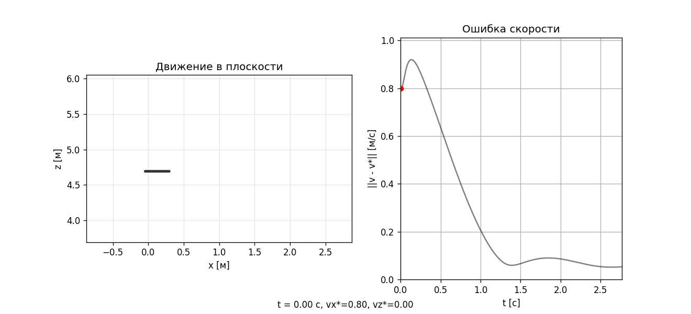
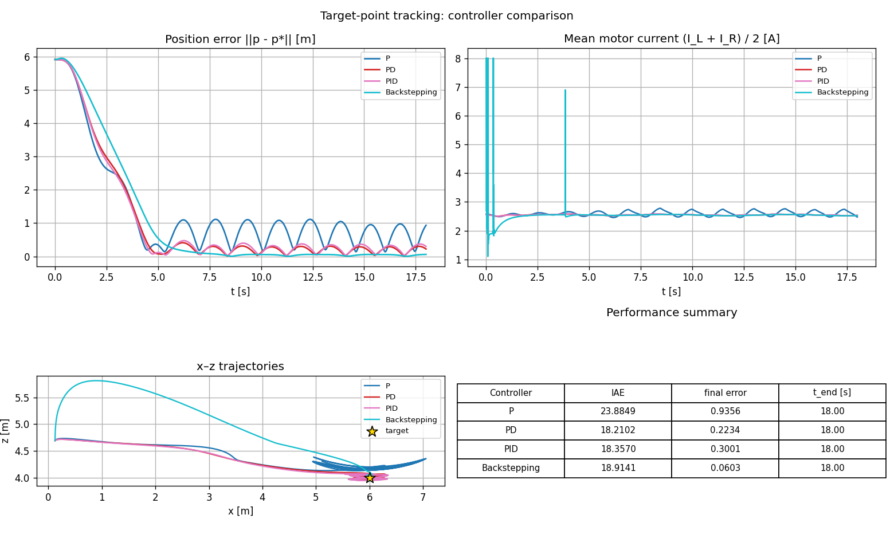
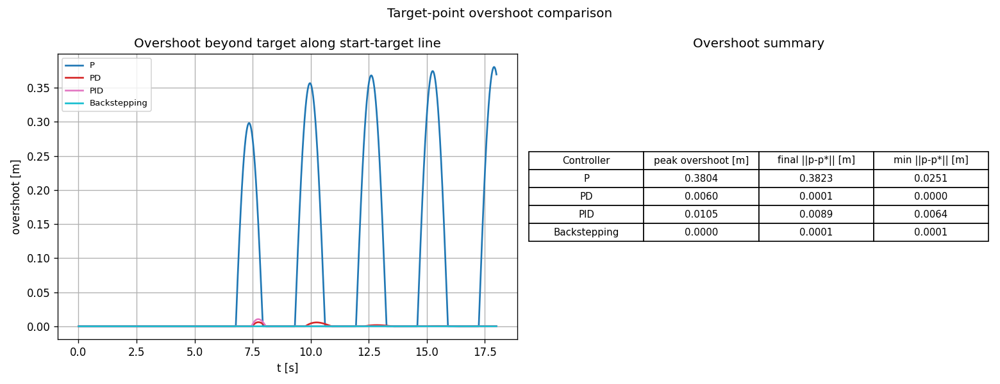
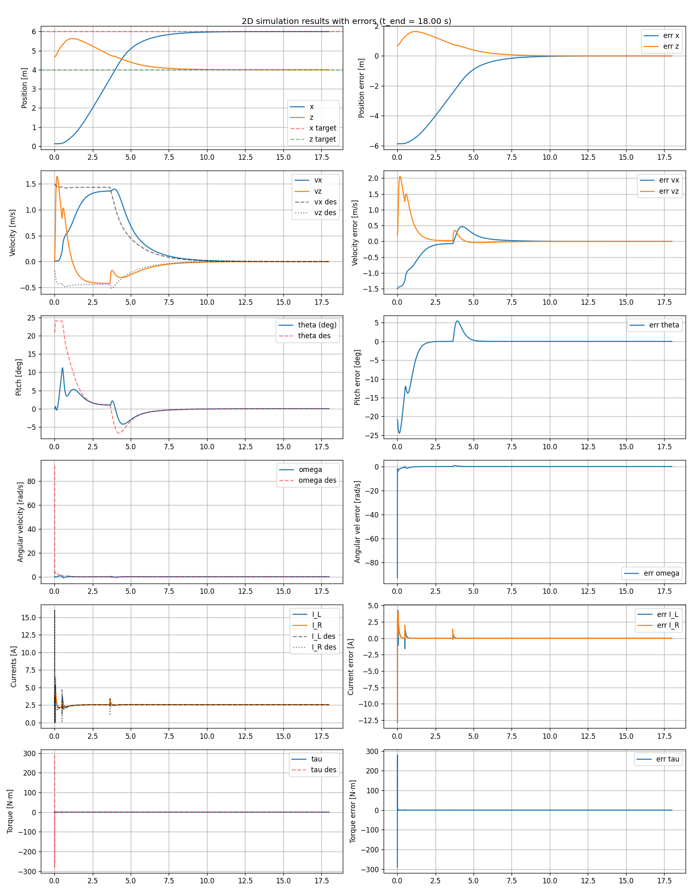
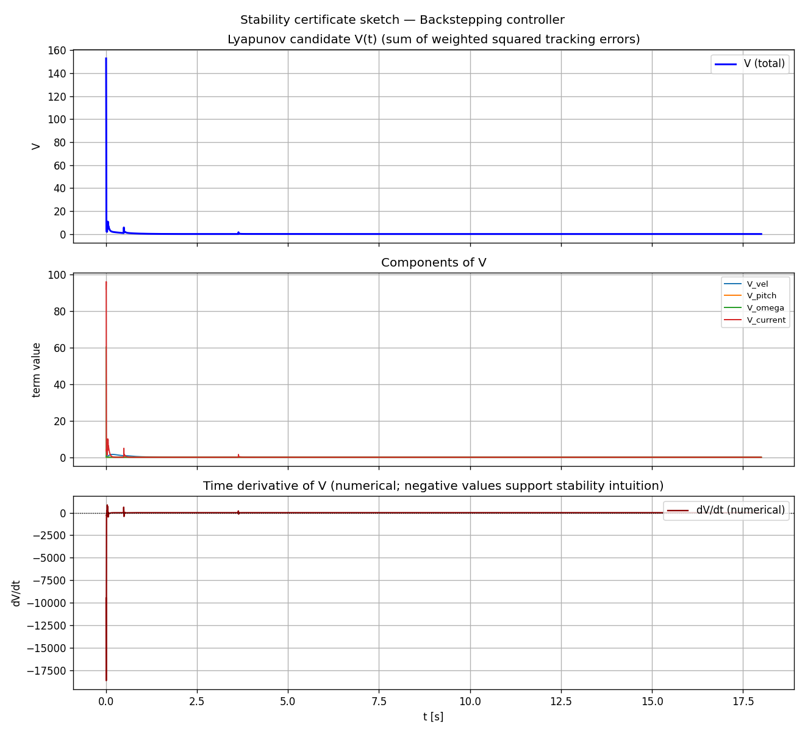

# Backstepping Control of a Planar Drone (2D)

This project studies **target-point regulation** of a planar drone moving in the vertical `x-z` plane. The model has **two motors**, **quadratic thrust-current relation**, **first-order motor current dynamics**

The project compares four controllers under the same conditions:

- **P**
- **PD**
- **PID**
- **Backstepping with motor-current dynamics**

The main goal is to show that accounting for actuator dynamics through backstepping improves target tracking and provides a meaningful stability certificate.



---

# 1. Problem Statement

Consider a wind-free planar drone moving in the vertical plane $(x, z)$. The goal is to stabilize the drone at the desired point

$$
x \to x^{\ast}, \qquad z \to z^{\ast},
$$

with zero velocity and zero pitch angle:

$$
v_x \to 0, \qquad v_z \to 0, \qquad \theta \to 0, \qquad \omega \to 0.
$$

Unlike a simple model where the thrust or acceleration can be commanded directly, we want to design the controller **down to the motor-current level**. Therefore, the real control inputs are not accelerations or thrusts, but motor current commands.

Let

$$
I_0 = \sqrt{\frac{mg}{2k_F}}
$$

be the hover current of each motor. We introduce current deviations from hover:

$$
i_L = I_L - I_0, \qquad i_R = I_R - I_0.
$$

Instead of working directly with left and right current deviations, we use collective and differential coordinates:

$$
i_s = i_L + i_R, \qquad i_d = i_R - i_L.
$$

Here:

- $i_s$ controls the vertical thrust deviation;
- $i_d$ controls the pitch torque.

The corresponding control inputs are collective and differential current commands:

$$
u_s = u_L + u_R, \qquad u_d = u_R - u_L,
$$

where

$$
u_L = I_{L,cmd} - I_0, \qquad u_R = I_{R,cmd} - I_0.
$$

The physical motor commands can be recovered as

$$
I_{L,cmd} = I_0 + \frac{u_s - u_d}{2}, \qquad
I_{R,cmd} = I_0 + \frac{u_s + u_d}{2}.
$$

The objective is to construct a backstepping controller for $u_s$ and $u_d$ and prove global asymptotic stability of the origin of the error dynamics.

---

# 2. Transformation to State-Space Form

We use the hover-linearized planar drone model. Around hover, the thrust-current relation is linearized as

$$
T_k = k_F I_k^2 \approx k_F I_0^2 + 2k_F I_0 i_k.
$$

Since

$$
2k_F I_0^2 = mg,
$$

the hover thrust compensates gravity, and the remaining vertical acceleration is controlled by $i_s$.

The state vector is

$$
X =
\begin{bmatrix}
x & z & v_x & v_z & \theta & \omega & i_s & i_d
\end{bmatrix}^{T}.
$$

The model is

$$
\begin{aligned}
\dot x &= v_x, & \dot v_x &= g\theta, & \dot \theta &= \omega, & \dot \omega &= a_d i_d, \\
\tau_m \dot i_d &= -i_d + u_d, & \dot z &= v_z, & \dot v_z &= a_s i_s, & \tau_m \dot i_s &= -i_s + u_s.
\end{aligned}
$$

The constants are

$$
a_s = \frac{2k_F I_0}{m}, \qquad a_d = \frac{2Lk_F I_0}{J},
$$

where:

- $m$ is the drone mass;
- $J$ is the pitch moment of inertia;
- $L$ is the arm length;
- $k_F$ is the thrust coefficient;
- $\tau_m$ is the motor current time constant.

The system naturally splits into two strict-feedback chains.

Vertical chain:

$$
u_s \rightarrow i_s \rightarrow v_z \rightarrow z.
$$

Horizontal chain:

$$
u_d \rightarrow i_d \rightarrow \omega \rightarrow \theta \rightarrow v_x \rightarrow x.
$$

This structure is exactly what makes backstepping suitable.

---

# 3. Idea of Backstepping

The key idea of backstepping is to stabilize the system recursively.

For the vertical motion, we do not directly control $z$. Instead, the chain is:

$$
u_s \to i_s \to v_z \to z.
$$

So we proceed step by step:

1. Choose a desired vertical velocity to stabilize $z$.
2. Choose a desired collective current $i_s$ to stabilize $v_z$.
3. Choose the actual current command $u_s$ to make $i_s$ track its desired value.

For the horizontal motion, the chain is longer:

$$
u_d \to i_d \to \omega \to \theta \to v_x \to x.
$$

So we recursively define:

1. desired horizontal velocity;
2. desired pitch angle;
3. desired pitch rate;
4. desired differential current;
5. actual differential current command.

At every step, we introduce a new error variable and add its squared value to the Lyapunov function. The control law is chosen so that the derivative of the Lyapunov function becomes negative definite.

---

# 4. Choice of Control Law

## 4.1. Vertical channel

Define the vertical position error:

$$
e_{z1} = z - z^{\ast}.
$$

Choose the virtual desired vertical velocity:

$$
\alpha_{z1} = -k_{z1}e_{z1}.
$$

Define the vertical velocity error:

$$
e_{z2} = v_z - \alpha_{z1}.
$$

Since $\dot z = v_z$, we have

$$
\dot e_{z1} = v_z = e_{z2} + \alpha_{z1} = e_{z2} - k_{z1}e_{z1}.
$$

Now choose the desired collective current:

$$
\alpha_{z2} = \frac{\dot\alpha_{z1} - e_{z1} - k_{z2}e_{z2}}{a_s}.
$$

Define the collective current tracking error:

$$
e_{z3} = i_s - \alpha_{z2}.
$$

Since $\dot v_z = a_s i_s$, we get

$$
\dot e_{z2} = a_s i_s - \dot\alpha_{z1}.
$$

Substituting $i_s = e_{z3} + \alpha_{z2}$, we obtain

$$
\dot e_{z2} = -e_{z1} - k_{z2}e_{z2} + a_s e_{z3}.
$$

Finally, using the motor current dynamics $\tau_m\dot i_s = -i_s + u_s$, we choose the real collective current command:

$$
u_s = i_s + \tau_m\left(\dot\alpha_{z2} - a_s e_{z2} - k_{z3}e_{z3}\right).
$$

Then

$$
\dot e_{z3} = -a_s e_{z2} - k_{z3}e_{z3}.
$$

---

## 4.2. Horizontal channel

Define the horizontal position error:

$$
e_{x1} = x - x^{\ast}.
$$

Choose the virtual desired horizontal velocity:

$$
\alpha_{x1} = -k_{x1}e_{x1}.
$$

Define

$$
e_{x2} = v_x - \alpha_{x1}.
$$

Then

$$
\dot e_{x1} = e_{x2} - k_{x1}e_{x1}.
$$

Since $\dot v_x = g\theta$, choose the desired pitch angle:

$$
\alpha_{x2} = \frac{\dot\alpha_{x1} - e_{x1} - k_{x2}e_{x2}}{g}.
$$

Define the pitch angle error:

$$
e_{x3} = \theta - \alpha_{x2}.
$$

Then

$$
\dot e_{x2} = -e_{x1} - k_{x2}e_{x2} + g e_{x3}.
$$

Now choose the desired pitch rate:

$$
\alpha_{x3} = \dot\alpha_{x2} - g e_{x2} - k_{x3}e_{x3}.
$$

Define

$$
e_{x4} = \omega - \alpha_{x3}.
$$

Since $\dot\theta = \omega$, we obtain

$$
\dot e_{x3} = -g e_{x2} - k_{x3}e_{x3} + e_{x4}.
$$

Next, since $\dot\omega = a_d i_d$, choose the desired differential current:

$$
\alpha_{x4} = \frac{\dot\alpha_{x3} - e_{x3} - k_{x4}e_{x4}}{a_d}.
$$

Define the differential current tracking error:

$$
e_{x5} = i_d - \alpha_{x4}.
$$

Then

$$
\dot e_{x4} = -e_{x3} - k_{x4}e_{x4} + a_d e_{x5}.
$$

Finally, using $\tau_m\dot i_d = -i_d + u_d$, choose the actual differential current command:

$$
u_d = i_d + \tau_m\left(\dot\alpha_{x4} - a_d e_{x4} - k_{x5}e_{x5}\right).
$$

Then

$$
\dot e_{x5} = -a_d e_{x4} - k_{x5}e_{x5}.
$$

All gains are assumed positive:

$$
k_{z1}, k_{z2}, k_{z3} > 0, \qquad
k_{x1}, k_{x2}, k_{x3}, k_{x4}, k_{x5} > 0.
$$

---

# 5. Global Stability Proof

## 5.1. Vertical channel proof

Consider the vertical Lyapunov function:

$$
V_z = \frac{1}{2}e_{z1}^2 + \frac{1}{2}e_{z2}^2 + \frac{1}{2}e_{z3}^2.
$$

Its derivative is

$$
\dot V_z = e_{z1}\dot e_{z1} + e_{z2}\dot e_{z2} + e_{z3}\dot e_{z3}.
$$

Substitute the closed-loop error dynamics:

$$
\begin{aligned}
\dot e_{z1} &= e_{z2} - k_{z1}e_{z1}, \\
\dot e_{z2} &= -e_{z1} - k_{z2}e_{z2} + a_s e_{z3}, \\
\dot e_{z3} &= -a_s e_{z2} - k_{z3}e_{z3}.
\end{aligned}
$$

Then

$$
\begin{aligned}
\dot V_z
={}& e_{z1}(e_{z2}-k_{z1}e_{z1}) \\
&+ e_{z2}(-e_{z1}-k_{z2}e_{z2}+a_s e_{z3}) \\
&+ e_{z3}(-a_s e_{z2}-k_{z3}e_{z3}) \\
={}& -k_{z1}e_{z1}^2 - k_{z2}e_{z2}^2 - k_{z3}e_{z3}^2.
\end{aligned}
$$

Therefore, $\dot V_z < 0$ for all nonzero vertical error states. Thus, the vertical subsystem is globally asymptotically stable.

---

## 5.2. Horizontal channel proof

Consider the horizontal Lyapunov function:

$$
V_x = \frac{1}{2}e_{x1}^2 + \frac{1}{2}e_{x2}^2 + \frac{1}{2}e_{x3}^2 + \frac{1}{2}e_{x4}^2 + \frac{1}{2}e_{x5}^2.
$$

Its derivative is

$$
\dot V_x = \sum_{j=1}^{5} e_{xj}\dot e_{xj}.
$$

The closed-loop horizontal error dynamics are

$$
\begin{aligned}
\dot e_{x1} &= e_{x2} - k_{x1}e_{x1}, \\
\dot e_{x2} &= -e_{x1} - k_{x2}e_{x2} + g e_{x3}, \\
\dot e_{x3} &= -g e_{x2} - k_{x3}e_{x3} + e_{x4}, \\
\dot e_{x4} &= -e_{x3} - k_{x4}e_{x4} + a_d e_{x5}, \\
\dot e_{x5} &= -a_d e_{x4} - k_{x5}e_{x5}.
\end{aligned}
$$

Substitute them into $\dot V_x$:

$$
\begin{aligned}
\dot V_x
={}& e_{x1}(e_{x2}-k_{x1}e_{x1}) \\
&+ e_{x2}(-e_{x1}-k_{x2}e_{x2}+g e_{x3}) \\
&+ e_{x3}(-g e_{x2}-k_{x3}e_{x3}+e_{x4}) \\
&+ e_{x4}(-e_{x3}-k_{x4}e_{x4}+a_d e_{x5}) \\
&+ e_{x5}(-a_d e_{x4}-k_{x5}e_{x5}) \\
={}& -k_{x1}e_{x1}^2 - k_{x2}e_{x2}^2 - k_{x3}e_{x3}^2 - k_{x4}e_{x4}^2 - k_{x5}e_{x5}^2.
\end{aligned}
$$

Therefore, $\dot V_x < 0$ for all nonzero horizontal error states. Thus, the horizontal subsystem is globally asymptotically stable.

---

## 5.3. Full Lyapunov function

Now define the full Lyapunov function:

$$
V = V_x + V_z.
$$

This gives

$$
\begin{aligned}
V
=& \frac{1}{2}e_{z1}^2 + \frac{1}{2}e_{z2}^2 + \frac{1}{2}e_{z3}^2 \\
&+ \frac{1}{2}e_{x1}^2 + \frac{1}{2}e_{x2}^2 + \frac{1}{2}e_{x3}^2 + \frac{1}{2}e_{x4}^2 + \frac{1}{2}e_{x5}^2.
\end{aligned}
$$

This function is positive definite and radially unbounded. Its derivative is

$$
\dot V = \dot V_z + \dot V_x.
$$

Therefore,

$$
\begin{aligned}
\dot V
=& -k_{z1}e_{z1}^2 - k_{z2}e_{z2}^2 - k_{z3}e_{z3}^2 \\
&- k_{x1}e_{x1}^2 - k_{x2}e_{x2}^2 - k_{x3}e_{x3}^2 - k_{x4}e_{x4}^2 - k_{x5}e_{x5}^2.
\end{aligned}
$$

Since all gains are positive, $\dot V < 0$ for all nonzero error vectors. Therefore, the equilibrium

$$
e_{z1}=e_{z2}=e_{z3}=0, \qquad
e_{x1}=e_{x2}=e_{x3}=e_{x4}=e_{x5}=0
$$

is globally asymptotically stable. This implies

$$
z \to z^{\ast}, \qquad v_z \to 0, \qquad i_s \to 0,
$$

and

$$
x \to x^{\ast}, \qquad v_x \to 0, \qquad \theta \to 0, \qquad \omega \to 0, \qquad i_d \to 0.
$$

Thus, the drone reaches the desired point and stabilizes at hover.

# 6. Numerical Simulation Setup

The numerical study compares four controllers under the same initial condition, target point, and integration settings. The simulation uses a fixed-step RK4 scheme with time step

$$
\Delta t = 0.004 \text{ s},
$$

and a total horizon of

$$
T_{\max} = 18 \text{ s}.
$$

The initial state is

$$
[x(0), z(0), v_x(0), v_z(0), \theta(0), \omega(0), I_L(0), I_R(0)]^T,
$$

where the position is randomized as

$$
x(0) \in [-0.5, 0.5], \qquad z(0) \in [2, 5],
$$

with seed `7`, and the initial velocities, pitch angle, and pitch rate are zero. The target point is fixed at

$$
p^\ast = [6.0, 4.0]^T.
$$

The main physical parameters used in simulation are:

$$
m = 0.5 \text{ kg}, \qquad g = 9.81 \text{ m/s}^2, \qquad J = 0.014 \text{ kg m}^2,
$$

$$
L = 0.18 \text{ m}, \qquad k_F = 0.38, \qquad \tau_m = 0.07 \text{ s}.
$$

To make the comparison fair, early stopping is disabled and all controllers are evaluated on the same fixed horizon.

# 7. Baseline Controllers

The project compares the proposed backstepping controller with three standard baselines: P, PD, and PID. All three baselines use the same outer position-to-velocity structure and the same thrust-pitch allocation and motor inversion logic, so the main difference is in the velocity regulation law.

The **P** controller uses only proportional feedback on the velocity error:

$$
a_{des} = k_p (v_{des} - v).
$$

The **PD** controller adds derivative damping:

$$
a_{des} = k_p (v_{des} - v) - k_d a.
$$

The **PID** controller additionally integrates the velocity error:

$$
a_{des} = k_p (v_{des} - v) - k_d a + k_i \int (v_{des} - v)\,dt,
$$

with integral clamping to avoid windup.

The **Backstepping** controller explicitly handles the cascade from position to velocity, pitch, angular rate, and motor currents. It is therefore the only controller in the comparison that directly accounts for actuator dynamics in its design.

# 8. Experimental Results

## 8.1 Controller comparison



**Figure 1 — Controller comparison.**

The results show a clear advantage of backstepping in target tracking accuracy. In the controller comparison plot, the backstepping trajectory converges to the target with the smallest final position error, while the classical P/PD/PID controllers exhibit larger transient deviations.

## 8.2 Overshoot comparison



**Figure 2 — Overshoot comparison.**

The overshoot comparison confirms that backstepping approaches the target more smoothly. Because overshoot is measured along the line from the initial point to the target, this plot is especially informative for showing whether a controller passes beyond the goal with excessive momentum.

## 8.3 Detailed backstepping run



**Figure 3 — Backstepping diagnostic plots.**

The detailed backstepping diagnostics indicate that the controller keeps pitch, angular rate, and motor currents bounded while still reducing the tracking error.

## 8.4 Lyapunov certificate



**Figure 4 — Lyapunov certificate for Backstepping.**

The Lyapunov-style certificate is useful as a qualitative stability diagnostic: the composite function decreases over time in the nominal run, which is consistent with the stability mechanism of the backstepping design.

# 9. Discussion and Limitations

The main strength of the proposed controller is that it treats the motor-current dynamics as part of the control design rather than as an ignored actuator lag. This makes the closed-loop behavior more consistent with the physical plant and improves tracking under the same actuator constraints.

At the same time, the implementation still relies on a simplified planar model. It does not capture full 3D motion, strong aerodynamic nonlinearities, or highly uncertain wind fields. The outer-loop saturation and pitch limits are also important: they improve robustness, but they can reduce performance when the target is far away or the initial error is large.

The Lyapunov function used in the code is best interpreted as a diagnostic certificate for the simulated backstepping run, not as a complete proof for the full saturated nonlinear cascade. Even so, it is valuable because it visualizes how the weighted tracking errors evolve together.

# 10. Reproducibility

To reproduce the results, install the dependencies and run the main script:

```bash
uv sync
uv run python main.py
```

The script generates the comparison plots, the overshoot figure, the backstepping diagnostic plot, the Lyapunov certificate, the animated GIF, and the interactive Plotly dashboard. The exact filenames used by the current code are:

| File | Description |
|------|-------------|
| `controllers_comparison.png` | controller comparison |
| `overshoot_comparison.png` | overshoot comparison |
| `results_2d_backstepping_with_errors.png` | detailed backstepping signals |
| `lyapunov_certificate.png` | Lyapunov-style certificate |
| `drone_2d.gif` | animation |
| `dashboard_2d.html` | interactive Plotly dashboard |

The experiment is deterministic because the random seed is fixed to `7`.

# 11. Repository Layout

The repository is organized as follows:

```text
project_3_Backsteping_Drone_Wind_2/
├── README.md
├── main.py
├── pyproject.toml
├── uv.lock
├── src/
│   ├── system.py
│   ├── controller.py
│   ├── simulation.py
│   ├── plots.py
│   ├── visualization.py
│   └── plotly_dashboard.py
├── controllers_comparison.png
├── overshoot_comparison.png
├── results_2d_backstepping_with_errors.png
├── lyapunov_certificate.png
├── drone_2d.gif
└── dashboard_2d.html
```

The code is split into a plant model, controller implementations, simulation routines, plotting utilities, visualization tools, and an interactive dashboard module. This separation makes it easier to extend the project with new controllers or alternative plant models.
