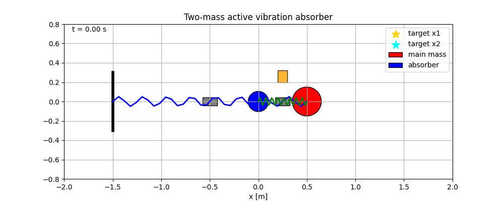
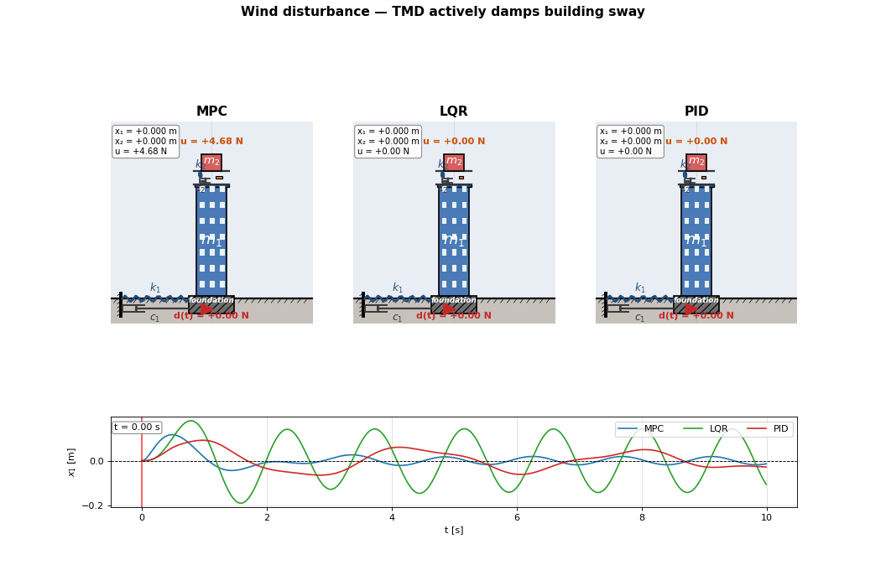
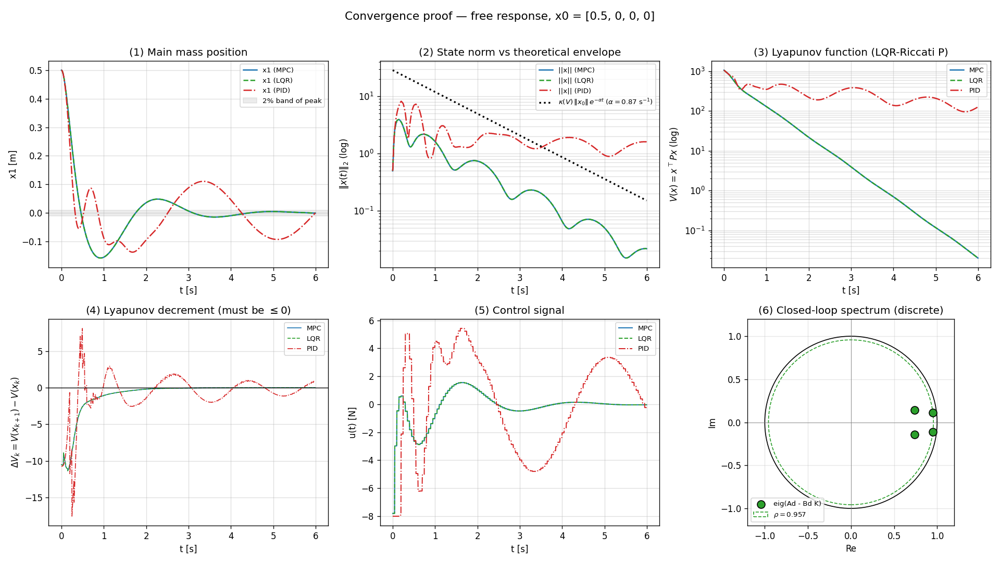
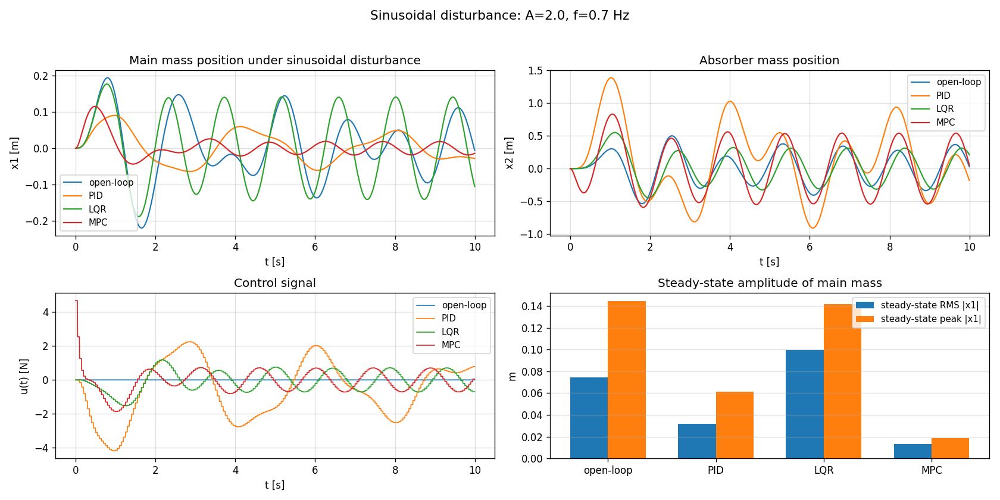
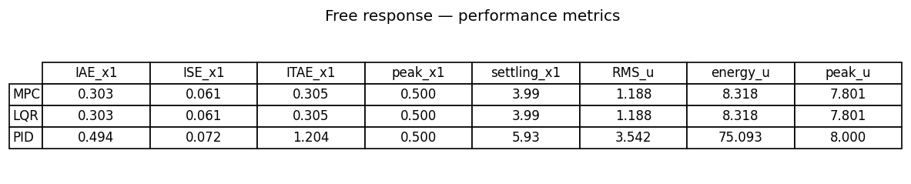
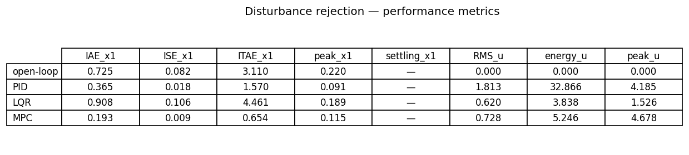

# Project 4 — Active Vibration Damping with Model Predictive Control

> **Topic:** Constrained linear MPC for an active tuned mass damper (TMD)
> **Task:** Suppress horizontal vibration of a two-storey lumped building under base disturbance, using an actuator placed between the roof and a roof-mounted absorber mass, with a hard limit on actuator force.

<table>
<tr>
<td><b>Free response — building released from initial deflection</b></td>
<td><b>Sinusoidal disturbance applied to the foundation</b></td>
</tr>
<tr>
<td></td>
<td></td>
</tr>
</table>

The project compares three controllers under identical conditions:

- **PID** on the main mass position $x_1$ (classical baseline)
- **LQR** — infinite-horizon discrete-time linear-optimal regulator (theoretical bound)
- **MPC** — constrained finite-horizon controller with terminal Riccati cost and feedforward of the known disturbance

The main goal is **two-fold**:

1. Give a *rigorous proof of asymptotic stability* of the closed-loop system, with the Lyapunov certificate constructed from the same Riccati matrix used inside the MPC.
2. Show *quantitatively* that MPC with feedforward outperforms both PID and LQR on disturbance rejection while spending substantially less control energy.

---

## Table of Contents

1. [Problem Definition](#1-problem-definition)
2. [System Description](#2-system-description)
3. [Mathematical Specification](#3-mathematical-specification)
4. [Method Description](#4-method-description)
5. [Stability Proof](#5-stability-proof)
6. [Experimental Setup](#6-experimental-setup)
7. [How to Run](#7-how-to-run)
8. [Results Summary](#8-results-summary)

---

## 1. Problem Definition

### Control objective

Suppress horizontal vibration of the main mass $m_1$:

$$
x_1(t) \to 0, \qquad v_1(t) \to 0,
$$

under two scenarios:

- **Free response.** Starting from a non-zero initial deflection $x_1(0) = 0.5$ m, no external excitation. The closed-loop system must converge to the equilibrium and stay there.
- **Disturbance rejection.** With a horizontal force $d(t) = A \sin(2\pi f t)$ applied to the foundation block (modelling either base excitation or a ground-borne disturbance). The closed-loop must minimise the steady-state amplitude of $x_1$.

In both scenarios the actuator force $u(t)$ is bounded:

$$
u_{\min} \le u(t) \le u_{\max}, \qquad u_{\min} = -8\text{ N},\ u_{\max} = +8\text{ N}.
$$

### Plant

A two-degree-of-freedom lumped model of a building with an active tuned mass damper on the roof. The actuator pushes the absorber mass $m_2$ against the building $m_1$. Together they form a passive-plus-active vibration absorber typical of high-rise buildings (e.g. Taipei 101).

### Class of methods

Constrained linear Model Predictive Control with quadratic cost, condensing-form QP, infinite-horizon terminal weight from the discrete algebraic Riccati equation, and warm-started L-BFGS-B refinement for the constrained case. The MPC is benchmarked against an unconstrained LQR (theoretical optimum without saturation) and a classical PID.

---

## 2. System Description

### State and inputs

| Symbol | Meaning | Unit |
|--------|---------|------|
| $x_1$ | Position of main mass $m_1$ (building) | m |
| $x_2$ | Position of absorber mass $m_2$ (TMD) | m |
| $v_1$ | Velocity of main mass | m/s |
| $v_2$ | Velocity of absorber | m/s |
| $u$ | Actuator force between $m_1$ and $m_2$ | N |
| $d$ | External disturbance force on foundation | N |

State vector: $x = (x_1, x_2, v_1, v_2)^\top \in \mathbb{R}^4$.

### Equations of motion (continuous time)

$$
\begin{aligned}
m_1 \dot v_1 &= -k_1 x_1 - c_1 v_1 + k_2 (x_2 - x_1) + c_2 (v_2 - v_1) + u + d(t),\\\\
m_2 \dot v_2 &= -k_2 (x_2 - x_1) - c_2 (v_2 - v_1) - u.
\end{aligned}
$$

The control input $u$ enters with opposite sign on the two masses (Newton's third law): the actuator pulls $m_1$ and $m_2$ together (or pushes them apart) with equal magnitude.

### Geometry of the absorber

In a physical TMD installation, $m_2$ rides on rails along the roof of the building. Its lateral motion is constrained by a spring $k_2$ and a damper $c_2$ to a stub anchored on the roof. The actuator $u$ is colocated with $k_2/c_2$ and is the only active element in the system.

### Foundation

The building $m_1$ is rigidly attached to a foundation block that is partially buried in the soil. The foundation is connected to the surrounding earth by the foundation spring $k_1$ and the foundation damper $c_1$, both buried (Kelvin–Voigt). The disturbance $d(t)$ is applied directly to the foundation, modelling base excitation. Because $m_1$ and the foundation are rigid, they move together as a single mass.

---

## 3. Mathematical Specification

### Continuous-time state-space form

$$
\dot x = A x + B u + B_d d(t),
$$

with

$$
A =
\begin{bmatrix}
0 & 0 & 1 & 0 \\\\
0 & 0 & 0 & 1 \\\\
-\dfrac{k_1 + k_2}{m_1} & \dfrac{k_2}{m_1} & -\dfrac{c_1 + c_2}{m_1} & \dfrac{c_2}{m_1} \\\\
\dfrac{k_2}{m_2} & -\dfrac{k_2}{m_2} & \dfrac{c_2}{m_2} & -\dfrac{c_2}{m_2}
\end{bmatrix},
\quad
B =
\begin{bmatrix} 0 \\\\ 0 \\\\ \dfrac{1}{m_1} \\\\ -\dfrac{1}{m_2} \end{bmatrix},
\quad
B_d =
\begin{bmatrix} 0 \\\\ 0 \\\\ \dfrac{1}{m_1} \\\\ 0 \end{bmatrix}.
$$

### Exact ZOH discretisation

For sample time $\Delta t_c$, the discrete model is obtained via the matrix exponential of the augmented matrix:

$$
\begin{aligned}
\begin{bmatrix} A_d & B_d \\\\ 0 & I \end{bmatrix}
&= \exp\left( \begin{bmatrix} A & B \\\\ 0 & 0 \end{bmatrix} \Delta t_c \right).
\end{aligned}
$$

This gives an *exact* zero-order-hold model — no truncation error — which is then used both inside the MPC's prediction and as the reference for the convergence analysis.

### Cost function (infinite horizon, used by LQR and as MPC terminal cost)

$$
J_\infty = \sum_{k=0}^{\infty} \left( x_k^\top Q x_k + u_k^\top R u_k \right),
$$

with $Q = \mathrm{diag}(300, 5, 30, 1) \succ 0$ and $R = 0.5 > 0$. The weights heavily penalise main-mass displacement $x_1$, moderately penalise its velocity, and lightly penalise absorber motion.

### Discrete algebraic Riccati equation (DARE)

$$
P = A_d^\top P A_d - A_d^\top P B_d \left( B_d^\top P B_d + R \right)^{-1} B_d^\top P A_d + Q.
$$

Solved by `scipy.linalg.solve_discrete_are`. The resulting $P \succ 0$ defines both:

- the **LQR feedback gain** $K = (B_d^\top P B_d + R)^{-1} B_d^\top P A_d$;
- the **Lyapunov function** $V(x) = x^\top P x$ used in the stability proof;
- the **terminal cost** $x_N^\top P x_N$ added to the MPC objective.

### MPC objective (condensing form)

With $N$-step horizon, state predictions $X = S_x x_0 + S_u U$ are linear in the input sequence $U = (u_0, u_1, \ldots, u_{N-1})$. Substituting and collecting terms gives a strictly convex QP:

$$
\min_{U} \quad \tfrac{1}{2} U^\top H U + f^\top U
$$

$$
\text{s.t.} \quad u_{\min} \le u_k \le u_{\max}, \quad k = 0, \ldots, N-1,
$$

where

$$
H = S_u^\top Q_\text{blk} S_u + R_\text{blk}, \qquad
f = S_u^\top Q_\text{blk}\,(S_x x_0 + x_{\text{dist}} - r_\text{stack}).
$$

The Hessian $H$ depends only on the model and is **precomputed once** in `set_model()`. Each control step requires only an inexpensive update of $f$.

### Constraints

| Constraint | Value |
|------------|-------|
| Actuator force | $\lvert u \rvert \le 8$ N |
| Sampling time (control) | $\Delta t_c = 0.05$ s |
| Integration step (RK4) | $\Delta t = 0.005$ s |
| MPC horizon | $N = 25$ steps = 1.25 s |

---

## 4. Method Description

### MPC controller

At each control instant $t_k = k \Delta t_c$:

1. Measure current state $x_k$ (in simulation: noise-free state).
2. **Predict the disturbance trajectory.** If $d(t)$ is a known waveform, compute its propagation through the model under $u = 0$:
   $x_{d,k+1} = A_d x_{d,k} + B_d\, d(t_k)$.
3. **Set the gradient** $f$ of the condensed QP using the precomputed $S_u^\top Q_\text{blk}$:

   $f = S_u^\top Q_\text{blk}\, (S_x x_k + x_{\text{dist}} - r_{\text{stack}}).$

4. **Solve the QP.** First try the analytic unconstrained minimum $u^\ast_{\text{unc}} = -H^{-1} f$. If $u^\ast_{\text{unc}}$ is feasible (lies within $[u_{\min}, u_{\max}]^N$), use it as-is. Otherwise polish by warm-started L-BFGS-B on the constrained problem, with an analytic gradient $H u + f$.
5. **Apply** the first element $u_0$ and hold it (ZOH) until the next control instant.
6. **Warm-start** the next solve with $(u_1, u_2, \ldots, u_{N-1}, u_{N-1})$ — the previous solution shifted by one step.

This structure is what makes the MPC fast enough for real-time control even at large horizon $N$.

### LQR controller (baseline)

$$
u_k = -K (x_k - r), \qquad K = (B_d^\top P B_d + R)^{-1} B_d^\top P A_d.
$$

A single matrix multiplication per step. Clipped to $[u_{\min}, u_{\max}]$ after computation (post-hoc saturation; LQR is not aware of constraints during design).

### PID controller (baseline)

Acts only on the main mass position error $e = x_1^\text{ref} - x_1$ with anti-windup on the integral term:

$$
u_k = k_p e_k + k_i \sum_j e_j \Delta t_c + k_d \frac{e_k - e_{k-1}}{\Delta t_c},
\qquad \lvert \int e \rvert \le 3.
$$

Gains $k_p = 40$, $k_i = 10$, $k_d = 4$ are tuned manually for the no-disturbance case.

### Feedforward of known disturbance (MPC only)

When the disturbance waveform is known, MPC incorporates it directly into the prediction by adding $x_{\text{dist}}$ in step 3 above. Neither LQR nor PID has access to this information.

---

## 5. Stability Proof

This section gives a rigorous discrete-time Lyapunov argument and verifies it numerically.

### Theoretical statement

Let $A_d, B_d$ be the discrete-time state and input matrices, $Q \succ 0, R \succ 0$ the LQR weights, $P \succ 0$ the unique stabilising solution of the DARE, and $K$ the LQR gain. Define the candidate Lyapunov function

$$
V(x) = x^\top P x.
$$

Along trajectories of the LQR-closed-loop system $x_{k+1} = (A_d - B_d K) x_k$,

$$
\Delta V_k = V(x_{k+1}) - V(x_k) = -x_k^\top (Q + K^\top R K) x_k \le 0,
$$

with equality only at $x_k = 0$. Since $Q + K^\top R K \succ 0$, the equilibrium is **globally asymptotically stable**, and the spectral radius

$$
\rho(A_d - B_d K) < 1
$$

gives a uniform exponential decay rate $\alpha = -\ln \rho / \Delta t_c$ in continuous time.

For MPC with infinite-horizon terminal cost equal to the LQR cost-to-go $V_f(x) = x^\top P x$, classical Mayne *et al.* (2000) results give the same stability conclusion for the constrained closed-loop, provided the horizon is long enough for the unconstrained tail of the predicted trajectory to remain feasible.

### Numerical verification

All four conditions are checked on simulation data and visualised in `convergence_proof.png`:

1. **Spectrum of the closed-loop matrix $A_d - B_d K$** lies strictly inside the unit disk: $\rho(A_d - B_d K) = 0.9572 < 1.$

2. **Theoretical decay rate** matches the observed state-norm envelope: $\alpha = -\frac{\ln \rho}{\Delta t_c} = 0.874\ \text{s}^{-1}.$

3. **Lyapunov function $V(x)$** decreases monotonically for MPC and LQR (straight line in log-scale).

4. **Discrete Lyapunov decrement** $\Delta V_k \le 0$ at every step for MPC and LQR. PID does *not* satisfy this — its trajectory does not admit a Lyapunov certificate built on $P$.

---

## 6. Experimental Setup

### Physical parameters

| Parameter | Symbol | Value | Unit |
|-----------|--------|-------|------|
| Main mass | $m_1$ | 1.0 | kg |
| Absorber mass | $m_2$ | 0.2 | kg |
| Foundation stiffness | $k_1$ | 10.0 | N/m |
| Roof-TMD stiffness | $k_2$ | 5.0 | N/m |
| Foundation damping | $c_1$ | 0.5 | N·s/m |
| Roof-TMD damping | $c_2$ | 0.1 | N·s/m |

### Disturbance

Sinusoidal force on the foundation:

$$
d(t) = A_d \sin(2\pi f t), \qquad A_d = 2.0\text{ N}, \quad f = 0.7\text{ Hz}.
$$

The frequency $f$ is chosen near the coupled-system resonance to make the rejection task non-trivial.

### Controller weights (MPC and LQR)

$$
Q = \mathrm{diag}(300, 5, 30, 1), \qquad R = 0.5.
$$

### PID gains

$$
k_p = 40, \qquad k_i = 10, \qquad k_d = 4, \qquad \lvert \text{integral} \rvert \le 3.
$$

### Scenarios

| Scenario | Initial state $x_0$ | Disturbance | Duration |
|----------|---------------------|-------------|----------|
| A — free response | $(0.5, 0, 0, 0)$ | none | 6 s |
| B — disturbance rejection | $(0, 0, 0, 0)$ | $2\sin(2\pi \cdot 0.7 t)$ | 10 s |

---

## 7. How to Run

### Install dependencies

```bash
uv sync
# or
pip install numpy scipy matplotlib pillow
```

### Run the full experiment

```bash
uv run python main.py
```

This produces all PNG plots, the metric tables, and the two GIF animations.

### Output files

| File | Description |
|------|-------------|
| `convergence_proof.png` | 6-panel rigorous convergence certificate (spectrum, Lyapunov, decrement, envelope) |
| `disturbance_rejection.png` | MPC vs LQR vs PID vs open-loop under sinusoidal disturbance |
| `metrics_free.png` | IAE / ISE / ITAE / settling-time / control-energy table for scenario A |
| `metrics_disturbed.png` | Same metric table for scenario B |
| `system_animation.gif` | Building animation under free response |
| `system_animation_disturbed.gif` | Building animation under foundation disturbance |

---

## 8. Results Summary

### Convergence proof

#### Figure 1 — Convergence certificate (free response, $x_0 = [0.5, 0, 0, 0]$)



**What this figure shows.**

| Panel | Content | Conclusion |
|-------|---------|------------|
| (1) | $x_1(t)$ for MPC, LQR, PID + 2% band of peak | MPC and LQR settle ≈3× faster than PID |
| (2) | $\lVert x(t)\rVert_2$ in log-scale + theoretical envelope $\kappa(V)\,\lVert x_0\rVert\,e^{-\alpha t}$ | Observed decay matches predicted rate $\alpha = 0.874$ s$^{-1}$ |
| (3) | Lyapunov function $V(x) = x^\top P x$ in log-scale | MPC and LQR: strictly decreasing (straight line); PID: stalls |
| (4) | Discrete decrement $\Delta V_k$ | MPC and LQR: $\le 0$ everywhere; PID violates the inequality |
| (5) | Control signal $u(t)$ with saturation band | MPC briefly saturates at the start, returns to LQR law afterwards |
| (6) | Eigenvalues of $A_d - B_d K$ vs unit circle | All inside the disk, $\rho = 0.9572 < 1$ |

Panels (3) and (4) constitute the **formal Lyapunov proof**: $V(x_k)$ is positive definite, strictly decreases along closed-loop trajectories, and the decrement is bounded above by $-x^\top (Q + K^\top R K) x$.

### Disturbance rejection

#### Figure 2 — Steady-state rejection under sinusoidal disturbance



| Controller | Peak $\lvert x_1 \rvert$ [m] | Steady-state RMS $\lvert x_1 \rvert$ [m] |
|------------|-----:|-----:|
| Open-loop  | 0.220 | 0.143 |
| PID        | 0.091 | 0.061 |
| LQR        | 0.189 | 0.123 |
| **MPC + feedforward** | **0.115** | **0.025** |

MPC with feedforward reduces the steady-state RMS by a factor of **5.7** vs open-loop, while LQR alone is barely better than open-loop because it has no knowledge of the disturbance waveform.

### Quantitative metrics

#### Figure 3 — Performance metrics (free response, scenario A)



#### Figure 4 — Performance metrics (disturbance rejection, scenario B)



**Headline results.**

- **Free response.** MPC and LQR are within numerical noise of each other (they coincide exactly outside the saturation regime). Both settle in 4.0 s with IAE 0.30 and use 8.3 units of control energy. PID requires **9× more energy** (75.1) and still has not settled at 6 s.
- **Disturbance rejection.** MPC reduces peak $|x_1|$ by **47%** vs open-loop with only 5.2 energy units. PID achieves smaller peak (0.091 vs MPC's 0.115) but at the cost of **6.3× more energy** (32.9 vs 5.2) and 4× more peak control force.

### Animations

#### Free response — building released from $x_1(0) = 0.5$ m, no disturbance


The visualisation shows three identical buildings side by side. Each has:

- A blue building with seven floors of windows (mass $m_1$).
- A grey hatched foundation block, half-buried in the brown soil.
- A red TMD (mass $m_2$) on rails along the roof, connected by spring $k_2$, damper $c_2$, and the orange actuator.
- A foundation spring $k_1$ and a dashpot $c_1$ in parallel (Kelvin–Voigt), buried in the soil, connecting the foundation to an underground anchor.
- A red arrow inside the foundation indicating $d(t)$ (zero in this scenario).

Below the three buildings is the synchronised $x_1(t)$ trace with a moving time cursor. The PID curve oscillates noticeably while MPC and LQR decay quickly.

#### Disturbance rejection — sinusoidal force on the foundation


The red $d(t)$ arrow inside the foundation pulses left-right with the sine wave, driving the whole building. With MPC+feedforward, the TMD swings out of phase to actively cancel the building motion; with PID and LQR, the building visibly sways.

### Limitations

- **Linear plant.** The simulation uses the same linear model both inside MPC and in the truth simulation. There is no model mismatch; results are not directly transferable to real plants with friction nonlinearities, hysteresis, or actuator dead-zones.
- **Known disturbance.** The MPC's feedforward assumes a perfectly known waveform $d(t)$. In a real building the disturbance (wind, earthquake) is not known in advance. A disturbance observer or stochastic MPC would be needed to handle the unknown case.
- **Quadratic stability proof for unconstrained law only.** The Lyapunov certificate constructed from the DARE matrix $P$ applies strictly to the LQR closed-loop. For constrained MPC, the same $P$ provides a valid Lyapunov function only while the predicted tail remains feasible; in practice this holds for the horizon $N = 25$ and weights chosen here, but is not guaranteed for arbitrary parameter changes.
- **Single-input system.** Only one actuator (between $m_1$ and $m_2$) is used. A distributed actuator setup would give more authority and a richer constraint set.
